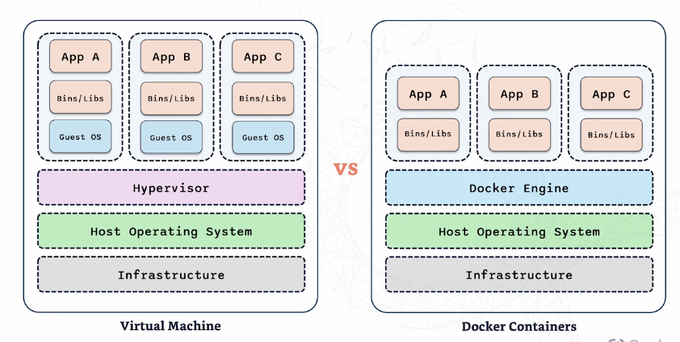
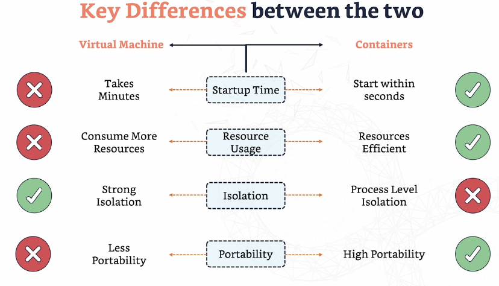

Containers are lightweight portable units for running apps, they bundle apps with all its dependencies ensuring it runs consistently across different environments

Containers include the code, run-time, libraries and all dependencies the app needs to run. 

Containers sit above the docker engine. Each container has the app and the Binaries/Libraries. The docker engine sits above the host OS (mac etc). The host OS sits on top the infrastructure. 

Docker engine- provides the env to build and run containers

Docker containers- Each container holds an application and all its dependencies required by the app. This isolation ensures each app runs consistently regardless of the application.

    - Docker containers are lightweight as they share the Host OS unlike VMs

Benefits of containers:

    - Isolation (own envs)
    - Consistent running of applications (due to dependencies etc)
    - Efficient: More resource efficient as they share the Host Kernel, which reduces overhead- Makes it faster to start up/boot

Docker

Open platform for developing/shipping applications in containers. It simplifies the process of creating/deploying and managing containers making it easier to build deploy and run applications.

- Docker engine: core service that runs and manages containers based on instructions from dockerfile

- Docker hub: A cloud service for sharing apps and automating workflows

- Docker image: Template for creating containers. They dont change once theyre created (immutable) allows for consistency

- Docker container: Running instances of images. Containers are what you interact with, you can start/stop etc

- Docker file: Used to build docker images. contains a series of instructions that docker uses to assemble an image. IE which image to use, what command to run etc

Importance in modern development

- Simplified deployment: One of the biggest challenges is ensuring applications run consistently on different envs (whether its developers machine or testers etc). Docker solves this

- Improved efficiency: Traditional VMs are resources heavy which causes long boot times, containers are lightweight as they share the host OS which allows it to boot quicker. Quick iterations are required in this age

- Enhanced collaboration: Easier to share development envs and apps with other developers. You can just create a docker image and share it with the team.

Containers vs VMs

- VMs allow multiple OS' to run on a single physical machine. Base is infrastrcture, then its host OS then its hypervisor which is responsible for creating and managing VMs by allocating CPU/Memory/Storage etc. Each VM runs its own Guest OS completely isolated from others 

Start Up Time- VMs need to boot up its own OS, containers use the host OS which makes it quicker

Resource usage- Each VM uses a whole OS which consumes significant resources, containers are efficient and use only what they need

Isolation- VMs provide strong isolation with each VM having its own OS. Containers share the host OS kernel but they have process level isolation and the process is running within the container

Portability- VMs are less portable due to their size and dependency on specific hypervisors. Containers are highly portable and can run consistently across various envs.

Docker Images

