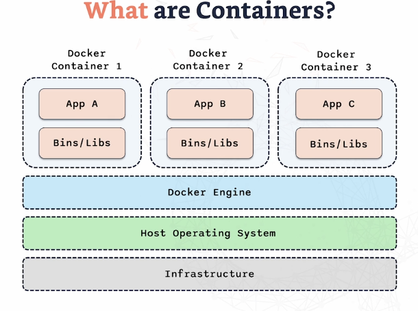

# Containers & Docker

**Containers** are lightweight, portable units for running applications. They bundle an app with all its dependencies, ensuring it runs consistently across different environments. Containers include the code, runtime, libraries, and all dependencies the app needs to run.

---

## Table of Contents
- [What are Containers?](#what-are-containers)
- [Docker Architecture](#docker-architecture)
- [Benefits of Containers](#benefits-of-containers)
- [Docker Components](#docker-components)
- [Importance in Modern Development](#importance-in-modern-development)
- [Containers vs VMs](#containers-vs-vms)

---

## What are Containers?

Containers are portable units that bundle applications with all the dependencies they require to run. This ensures that the application will run consistently regardless of the environment in which it is deployed (developer’s machine, test environment, production, etc.).

- **Containers include**: Code, runtime, libraries, and dependencies needed to run the app.
- **Containers sit above** the Docker Engine, while the Docker Engine sits on top of the host OS (macOS, Linux, etc.).
  

---

## Docker Architecture

- **Docker Engine**: The core service that provides the environment to build and run containers.
- **Docker Containers**: Each container holds an application and its dependencies. Containers ensure that applications run in isolation and consistently across environments.

    - Docker containers are lightweight because they share the Host OS kernel, unlike traditional VMs which require their own OS instance.

---

## Benefits of Containers

- **Isolation**: Each container has its own isolated environment.
- **Consistency**: Applications run consistently across different environments due to the bundled dependencies.
- **Efficiency**: Containers are more resource-efficient as they share the host kernel, reducing overhead and making them faster to boot than virtual machines.

---

## Docker Components

- **Docker Engine**: The core service that runs and manages containers. It processes the instructions from the Dockerfile to build and manage containers.
  
- **Docker Hub**: A cloud service for sharing applications and automating workflows. It allows developers to pull and push container images.
  
- **Docker Image**: A template for creating containers. Once created, Docker images are immutable, ensuring consistency when containers are spun up.
  
- **Docker Container**: The running instance of a Docker image. Containers are the units you interact with and can be started, stopped, or modified based on your requirements.
  
- **Dockerfile**: A script containing a series of instructions that Docker uses to assemble an image. The Dockerfile defines which base image to use, which commands to run, and other configurations for creating a Docker image.

---

## Importance in Modern Development

- **Simplified Deployment**: One of the biggest challenges in software development is ensuring that applications run consistently across various environments (developer's machine, tester’s environment, production). Docker containers solve this issue by packaging the application with all its dependencies, ensuring consistent behavior.
  
- **Improved Efficiency**: Traditional virtual machines (VMs) are resource-heavy and take longer to boot due to the full OS. Containers, on the other hand, are lightweight as they share the host OS kernel, making them much faster to start up.
  
- **Enhanced Collaboration**: With Docker, developers can easily share their development environments by creating a Docker image. This allows teams to collaborate more efficiently by ensuring everyone is working in the same environment.

---

## Containers vs VMs

- **Virtual Machines (VMs)** allow multiple operating systems (OS) to run on a single physical machine. The base is the infrastructure, followed by the host OS and a hypervisor, which manages the VMs. Each VM runs its own guest OS and is completely isolated from other VMs.

### Key Differences:

1. **Start-Up Time**:
   - **VMs**: Each VM requires its own OS, making the boot-up process slower.
   - **Containers**: Containers share the host OS, making them faster to start up.
   
2. **Resource Usage**:
   - **VMs**: Each VM consumes significant resources due to the full OS overhead.
   - **Containers**: Containers are more efficient, using only the resources necessary for the app and sharing the host OS.
   
3. **Isolation**:
   - **VMs**: Provide strong isolation with each VM running its own OS.
   - **Containers**: Share the host OS kernel but provide process-level isolation, ensuring the processes run within the container.
   
4. **Portability**:
   - **VMs**: Less portable due to their size and dependency on specific hypervisors.
   - **Containers**: Highly portable and able to run consistently across different environments.

---

## Visual Comparison

Containers and VMs have their own use cases, but containers are favored in modern development due to their efficiency, portability, and quick startup times.
