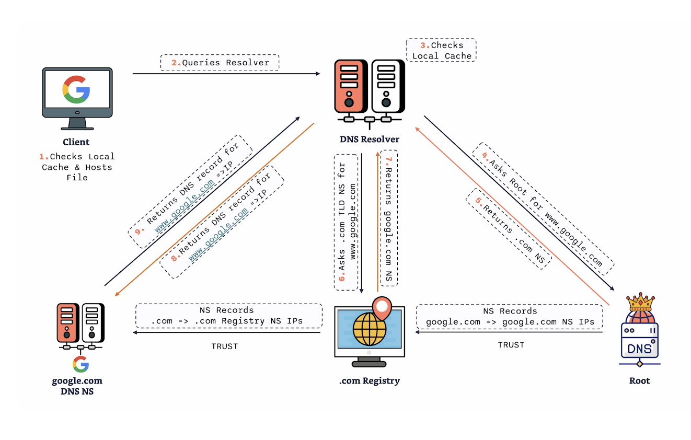

# DNS - Domain Name System

## Definition
Translate domain names to IP addresses.

## Role in Networking
- Simplifies navigation on the internet.
- Essential for accessing websites and services.

---

## DNS Components

### **Name Servers**
- Load DNS settings and configurations and respond to queries from clients or other services about domain names.

#### **Authoritative Name Servers**
- Hold the actual value of DNS records.
- When queried, they hold the definitive IP of a domain name.

#### **Recursive Name Servers**
- These do not hold the final answer but query other name servers on behalf of the client to find the correct DNS record.
- Recursive servers can also cache the information they retrieve to speed up future queries.

### **Zone Files**
- Stored within the name servers, containing information about the domain.
- They help name servers figure out how to get to a domain if the name server doesn't know directly.
- They handle DNS information in a readable and manageable way.

#### **Resource Records**
- A zone file comprises one or multiple resource records.
- Each record contains specific information about hosts, name servers, and various other resources.

##### **Components of Resource Records**:
- **Record Name**: The domain name being queried.
- **TTL**: Indicates how long the record is valid before a refresh is required.
- **Class**: The namespace of the record information.
- **Type**: The type of record (e.g., A (IPv4), MX (Mail), AAAA (IPv6), CNAME (Alias)).
- **NS**: Nameserver Record.
- **Data**: The actual information corresponding to the record type, such as the IP address for an A record.

---

## DNS Resolution
The process of converting domain names to IP addresses involves multiple steps and servers.

### **DNS Root**
- Stores high-level information on the way to find the top-level domains underneath it.

### **Top Level Domain (TLD)**
- TLDs include familiar extensions like `.org`, `.com`, etc.
- Each TLD stores information about domains within its scope.

### **Authoritative Name Servers**
- Each authoritative name server holds data such as host zones and domains.
- They contain the detailed DNS records for those domains (e.g., google.com has its own DNS records stored in an ANS).

### **Domain**
- Each domain has a zone and a zone file.
- The zone file is a detailed list of records for that particular domain, storing specific information like IP addresses and mail servers.

---

## DNS Resolution Process Example (google.com)

1. User types `www.google.com`  
   - The browser sends a request to the DNS resolver local to the user.
2. DNS resolver receives the request and queries its local cache.
3. If not in the local cache, the resolver queries the **Root server** for the IP.
4. The **Root server** doesn't yet know the IP but directs the resolver to the **TLD server**.
5. The resolver then queries the `.com` **TLD server** for the IP.
6. The **TLD server** doesn't know the exact IP but redirects the resolver to the **Authoritative Name Server**.
7. The resolver queries the **Authoritative Name Server** for the IP.
8. The IP `142.250.180.14` is returned to the DNS resolver.
9. The resolver returns the IP to the web browser, and the website loads.

## Domain Registrar vs DNS Hosting Provider

### **Registrar**
- Allows you to purchase and register domains.
- Communicates with the **TLD registry** to manage TLD registrations.
- Examples: Route53, GoDaddy, CloudFlare.

### **Hosting Provider**
- Operates DNS nameservers that manage DNS zones.
- Allows you to manage the DNS records within the zones.
- Examples: Route53 zones, etc.

### **Process Overview**:
When you purchase a domain, you need a DNS zone to be hosted on a DNS nameserver. The process varies depending on whether the hosting provider is the same as the registrar:

- **If they are the same company**, the DNS zone is automatically created and hosted.
- **If they are different companies**, you will need to provide the nameserver information where the DNS zone is already hosted.

