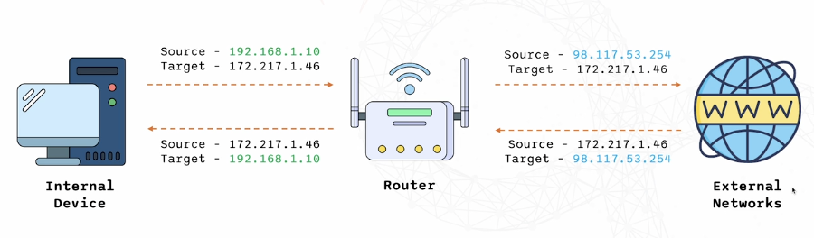
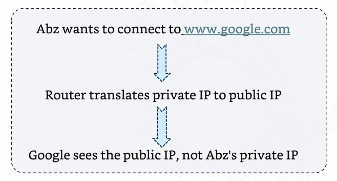

# NAT (Network Address Translation)

**NAT** is a method used to translate private IP addresses into a public IP address, enabling communication between internal networks and external networks (such as the internet). This process is crucial for optimizing IP address usage and ensuring network security.

## Table of Contents
- [How NAT Works](#how-nat-works)
- [Types of NAT](#types-of-nat)
- [NAT Example](#nat-example)
- [Benefits of NAT for DevOps](#benefits-of-nat-for-devops)

---

## How NAT Works

1. Devices within an internal network use **private IP addresses**.
2. A router with NAT enabled **translates private IP addresses into a public IP address**.
3. The NAT allows the device to **communicate with external networks** (such as the internet) using a shared public IP.

Here’s a simplified version of the NAT process:

- The device with a private IP makes a request, which is passed through the router.
- The **NAT translates the private IP to a public IP** before it connects to the internet.
- The external network's response is then sent back via the public IP to the router.
- The **NAT translates the public IP back to the private IP**, ensuring that the response reaches the correct internal device.

Without NAT, each device would need its own unique public IP address to communicate with the internet.

---

## Types of NAT

1. **Static NAT**
   - Maps a single private IP to a single public IP (1-to-1 mapping).
   - Useful when a device or server needs to be consistently reachable from the internet.

2. **Dynamic NAT**
   - Maps a private IP to a **public IP from a pool** of available public IP addresses.
   - When a device needs to access the internet, a public IP is assigned from the pool. Once done, the IP is returned to the pool.

3. **PAT (Port Address Translation)**
   - Also known as **NAT overload**.
   - Allows multiple devices to be mapped to a single public IP address but with **different port numbers**.
   - Extremely efficient and commonly used since it reduces the need for multiple public IPs.

---

## NAT Example

Here’s an illustration of how NAT works in practice:

In this example, multiple internal devices share the same public IP address using NAT. The router ensures that the traffic is routed correctly between the internal network and external servers.

---

## Benefits of NAT for DevOps

NAT provides several benefits for DevOps environments, especially when managing large infrastructures or cloud services:

- **IP Address Conservation**: Reduces the need for a large number of public IP addresses.
- **Security**: Shields internal network IP addresses from external view, enhancing network security.
- **Efficiency**: Allows multiple devices to communicate with the external network using a single public IP.
  

---

With the proper implementation of NAT, DevOps engineers can ensure efficient network management, security, and optimal use of IP resources.
