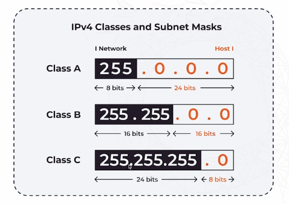

# Subnetting & CIDR

**Subnetting** is the process of dividing a large network into smaller, more manageable networks, improving efficiency, network traffic control, and IP address utilization.

**CIDR (Classless Inter-Domain Routing)** is a method used to allocate IP addresses and route IP packets. It provides more flexibility in IP address management compared to the old classful IP addressing.

---

## Table of Contents
- [Subnetting](#subnetting)
- [CIDR Format](#cidr-format)
- [Subnet Calculation](#subnet-calculation)
- [Subnet Mask](#subnet-mask)
- [Example Diagram](#example-diagram)

---

## Subnetting

Subnetting allows a network administrator to break a larger network into smaller sub-networks (or subnets). This leads to better management of IP address ranges, reduces network congestion, and improves security by isolating network segments.

---

## CIDR Format

CIDR uses a notation that includes the IP address and the number of bits used for the network portion of the address.

- **Format**: `IP_ADDRESS/Prefix_length`
- **Example**: 
    ```bash
    192.168.1.0/24
    ```

In the example:
- `192.168.1.0` is the network address.
- `/24` indicates that the first 24 bits are used for the network address, while the remaining 8 bits are used for host addresses within the network.

---

## Subnet Calculation

When subnetting, calculating the subnet involves determining which part of the IP address is for the network and which part is for individual hosts.

- **Subnet Mask**: A subnet mask is used to divide an IP address into a **network portion** and a **host portion**. It allows routers to distinguish which part of an IP address identifies the network and which part identifies the specific device or host.

---

## Subnet Mask

A **Subnet Mask** is a 32-bit number that helps in distinguishing the network and host portions of an IP address.

- In the example `192.168.1.0/24`, the **first 24 bits** of the address (`/24`) represent the **network** address, and the remaining bits represent the **host** addresses available within that network.

---

## Example Diagram

Here’s a visual representation of subnetting, showing how the network and host portions are divided:



In this example:
- The first 24 bits (`/24`) represent the **network** address.
- The remaining 8 bits are used for **host** addresses within the subnet.

---

Understanding Subnetting and CIDR is crucial for network administrators and engineers, enabling efficient IP address allocation, improving network security, and ensuring optimal performance of network infrastructure.
